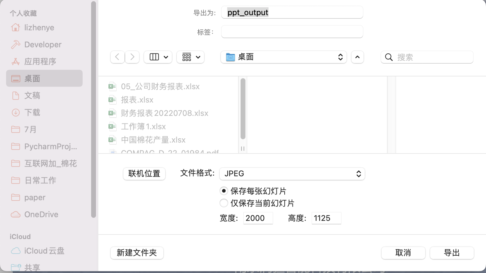
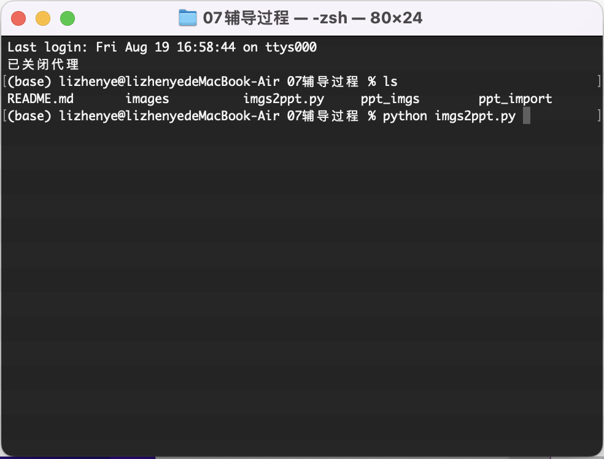
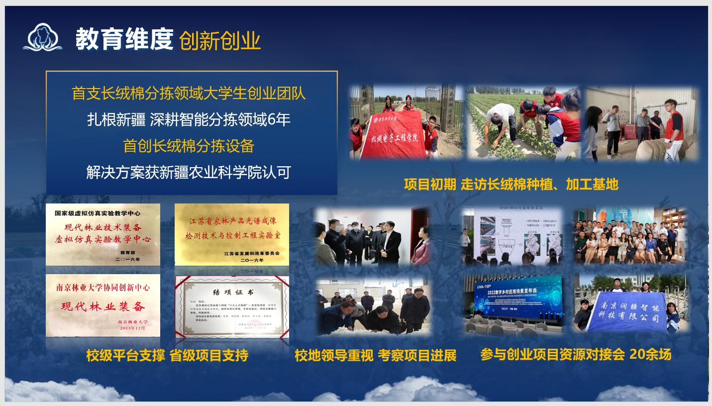
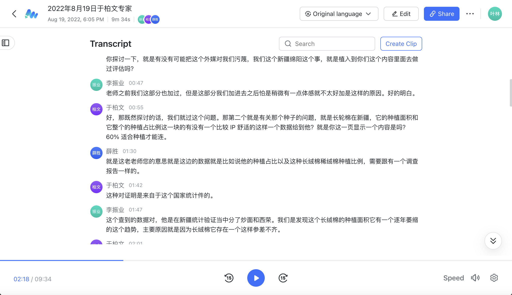
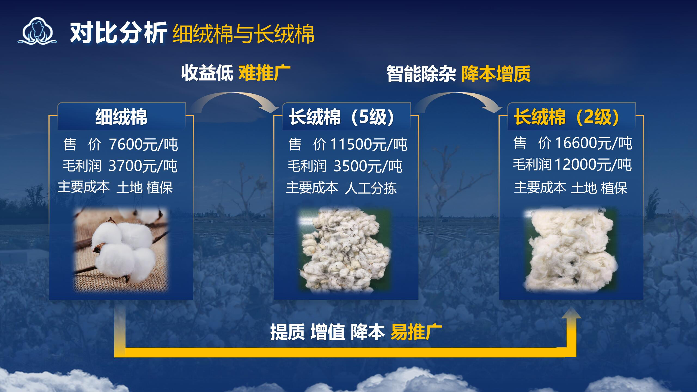

[TOC]

# PPT版本控制

长期以来，许多专家都会导致PPT发生多次调整，而PPT本身非常大，每个PPT都能占用500M的空间，保留所有版本对于电脑的磁盘空间极其不友好，也不可能实现有效的版本控制。另一方面对于各个版本的整理也会十分麻烦，回溯和查找都不好操作。

鉴于这一需求构建该仓库进行PPT版本管理。但是PPT文件属于二进制文件，无法进行增量比较，所以我这里仅利用PPT导出的图片进行图片版本的控制，结合python进行图片修改量比较。

## PPT文件导入

好的，我承认底下的方式有点蠢了。git版本控制最为擅长的还是进行纯文字文件的版本控制。所以我们可以用markdown进行可视化的查看PPT的各种顺序，然后再导出就行了。这样就很方便。

### 被舍弃的方案：

1. **将PPT导出为图片**

   使用MS OFFICE 自带的另存为功能(Windows)或者导出为即可将PPT导出为图片。导出图片大小建议为宽度`2000`，高度`1125`，对应新版PPT标准宽度`13.333英尺`和高度`7.5英尺`。

   

2. **将文件放置到项目文件夹当中的‘ppt_import’下**

3. **打开终端，运行导入脚本进行PPT图片增量式替换**

### 更加优雅的方案：

更加优雅的方案是直接把PPT文件组织为markdown文件，这样一方面可以利用markdown文件方便查看的特性进行ppt的顺序查看，另一方面也可以有效的降低图片管理需求。


## PPT文件导出

1. 在项目文件夹下打开终端运行相应的脚本即可导出

    ```shell
    python imgs2ppt.py
    ```

    

2. 高级的功能，可以指定转换的文件夹和输出的位置：

    ```shell
    python imgs2ppt.py -i '/path/to/images' -o '/file/to/output.pptx'
    ```

    把路径写在这两个input和output参数里头就行，这个就不多说了。

# 8月19日刘晓芳

完整答辩部分保留在[链接🔗](https://dlf4cvlgbr.feishu.cn/minutes/obcnvykp1udf7ey11sd649yv?from=from_copylink)下，点击进入并申请权限可进行查看和播放。

## 问题整理

### 产品技术

- 主要产品是分拣设备，分拣设备与项目的名字有什么关联？“异物”是什么？

- 调研研发：目前是否调研过新疆棉农如何处理杂质？新疆目前种植棉花去除异物的机器有吗？效果怎么样？项目研发了多久？负责人参与多久？时间挺长？
- 你们的设备也有大型、小型？设备去年上线吗？集中在今年收款吗？
- 技术的核心名字，负责人是第一作者吗，是独创的吗？整个产品的核心技术负责人全部掌握吗？

### 市场

- 这个领域的市场规模是多少？

- 目前市场的痛点：

  **答：** 人工分拣，人工分拣剔除不干净，现有机器会破坏长绒棉纤维。

- 目前我们设备进入市场的优势？目前覆盖了多少客户？是否有复购？

### 公司经营

- 公司估值5000万的依据（销售情况并不是很好）

  **答：**目前利润率，企业的增长速度；核心技术的无形价值；公司人才的积淀；目前的固定资产；通过第三方尽调公司，给我们评估出来的估值

- 目前团队分工？

  多学科组成，分工明确

## 修改意见

### 商业模式PPT

原PPT：


可以更加完善，要将润疆做的事情体现出来，运作流程没有问题，多体现核心团队参与的深度，一分为三，上游：技术来源，材料来源；中间展示润疆科技的工作，包括（技术研发、产品营销推广销售、技术指导、公司的经营管理）；接下来讲销售模式、推广模式、营销策略、目标客户、通过什么方式去面向客户、客户包含谁；后面再体现扶贫模式；合同没有必要在这体现。流程细化，加上直销面向谁，代理面向谁，目标客户再多一点，目标市场（先写大的，再细分）也可以写上，加上国外市场，新疆市场可能有点局限，营销策略和推广方式是怎么规划的？

修改待定

### 教育维度

原PPT


分为三个方面，在我们学校接受创新创业教育后对我们团队综合素养的体现；学校对创新创业的支持的平台，政策（可以体现）等；大赛育人，紧扣主题。

修改后PPT。



# 8月19日于柏文

答辩完整部分保留在[链接🔗](https://aq9udlob3v.feishu.cn/minutes/obcnv241nk3g8ahnrl42xvat)下，点击进行回放和查看。



## 问题整理

### 背景相关

- 是否有可能将外媒对新疆棉的污蔑融入你们项目内容去？

  **答：**这方面由于牵涉到一些敏感因素，我们不做讨论。

### 新疆情况相关

- 长绒棉目前在新疆，它的种植面积和它整个的种植占比例这一块是否有一个比较具体真实的数据？ 

  **答：**我们调查了国家统计年鉴的数据，可以得知，长绒棉目前的占比仅仅只有18%，并且这样的占比还存在逐年萎缩的状况。

## 修改意见

### 关于爱国情怀的讲稿修改

**修改要求提炼：**提炼并添加一句话凸显爱国情怀

立意升华：

> 从情怀方面来说，项目不光是一个挣钱的项目，还是改变我们国家高端棉纺品国际地位的一个好的项目。这样加分点就会更多一些。

(来自评委录音识别原文`5分18秒`)对，那如果说把它提升一下，提升的家国情怀这个方面的话，可能会你们就琢磨一句话，假如说你们觉得合适的话，可以放在最后边，你们这个不动再再加多一句，假如说时间够，你们就可以把它讲出来，时间不够了，你就过一下也行。好嘞，因为确实事实现实中也存在这个问题，就特别是高知的这种这种那个棉花，对，他需要这种现在产出的动不动他就退。就是进口面料的。然后这个手感他是 80 支纱还是 100 支更高是的更高的纱织。然后手感确实是好一些。我是说这个这个面料。第一这个面如果你选，如果说我们选这个面料的话，它第一贵一倍以上。第二它的过期好像还要长一些，所以实际上还是受制。于是就在高端的这个棉纺织品方面，我们作为纺织大国，把这高端棉纺织弊方面有各方面出版，也有代表想法。就是从这个维度看，你们能不能做一个提炼一下，就是增加一些内容进去，这样让大家觉得可能第一个和我们每一个人那都息息相关。

讲稿修改待定。

### 长绒棉背景PPT修改

**修改要求提炼：**修改背景，突出**高端**纺织品的需求是只有长绒棉才能满足的。

（来自评委录音识别原文`7分43秒`）你可以把这个痛点放进去，就是说我们好多评委都有过这个是属于 C 端，最终是 C 端纺织品对吧？比如说定制过衣服的人都知道，就是这些买过衣服的其实也一样也都知道。然后有同样考虑来的衬衫，那有几百块钱有几千块钱，你问店员为什么要几千块钱都是免的说人家进来就说我这个是什么金榜，还是反正这个故意不一样？然后你看这个手感确实是不一样，我估计每个评委都有这个经历，没有做过衣服，肯定也有买过这一。所以这其实是我们的一个痛点就是高端。虽然说中国作为纺织品的大国，纺织大果，但是高端的这样的一些布料，特别是你可以强调特别是你棉纺这一块还是有点受制于人。这样的话对，一下和我们评委距离都拉得非常近了。是的，这样的话可能就第一个案例，大家就会更加关注，希望你这个企业能做好，希望你多好。

期望添加到PPT的内容（目前暂时没有执行对PPT的修改）：


