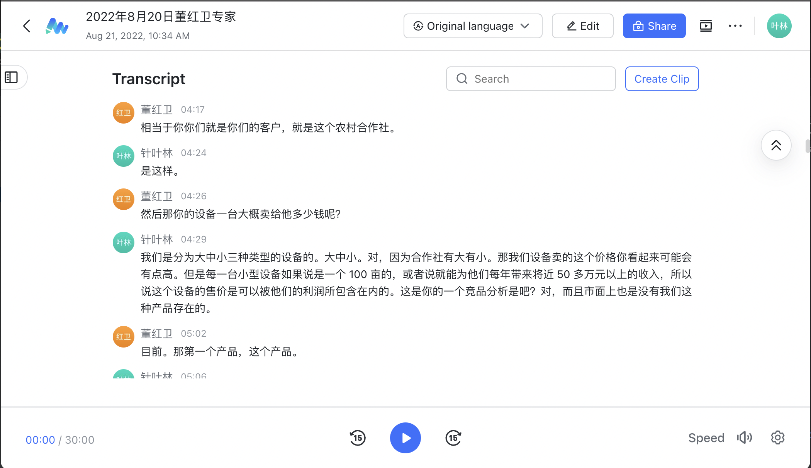
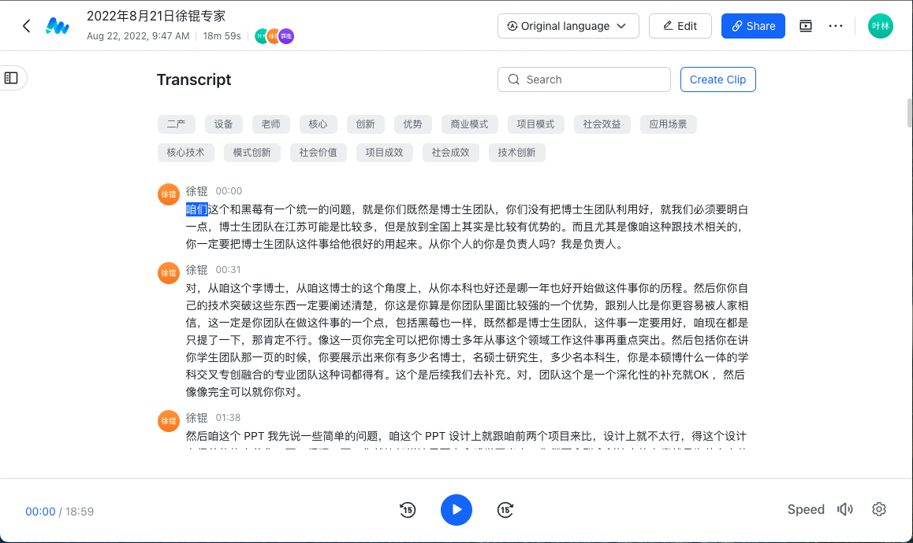
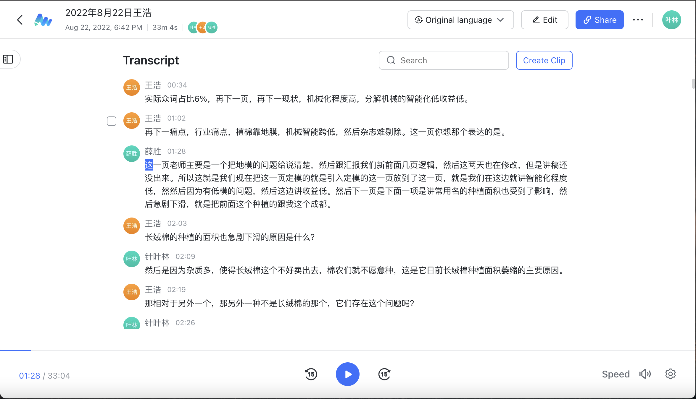
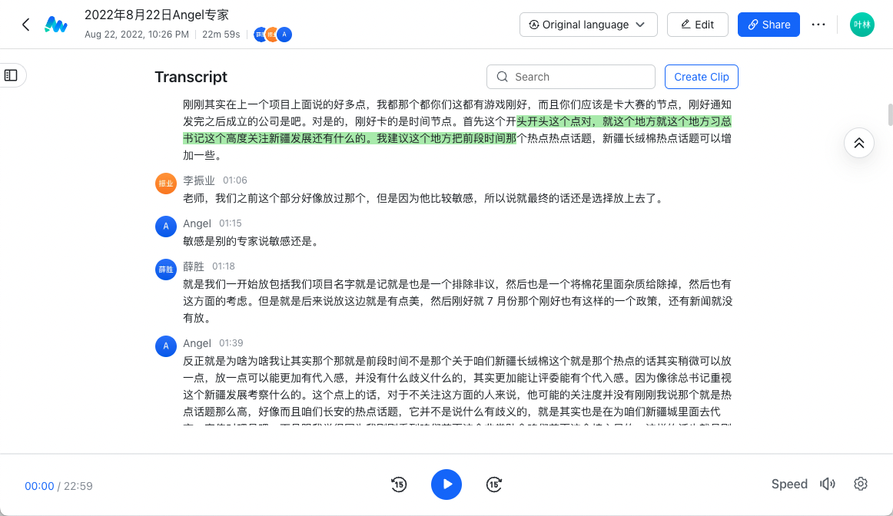
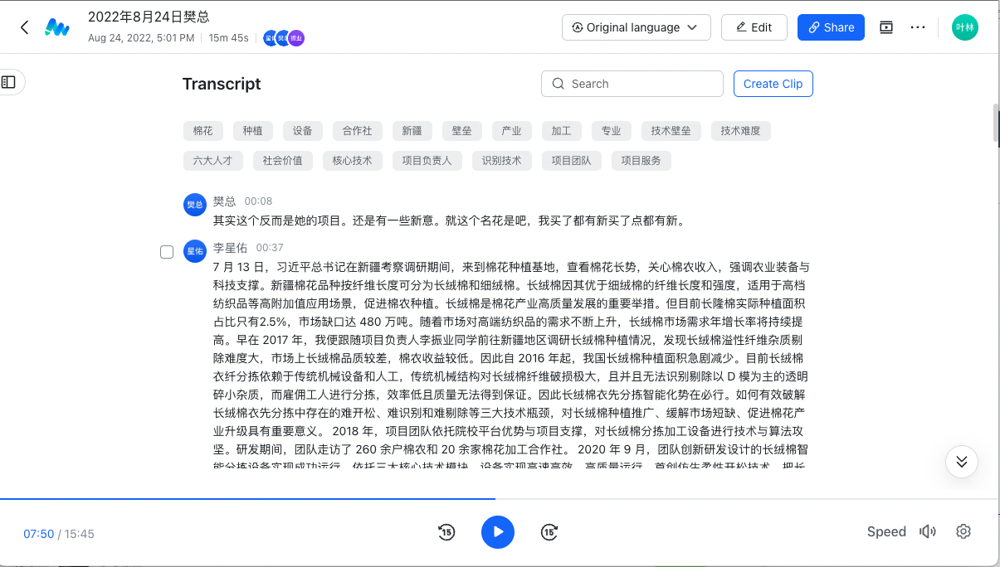
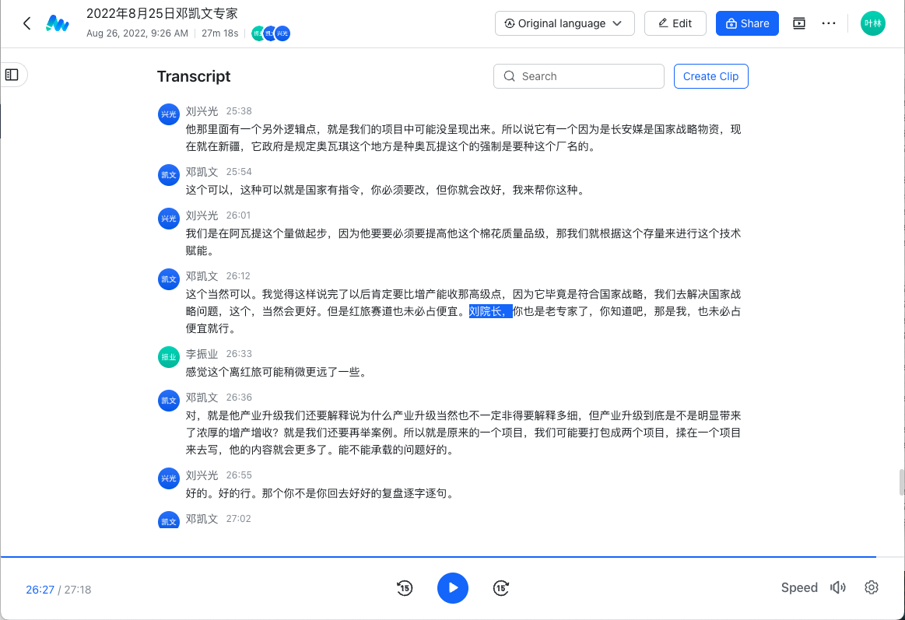

[TOC]

# PPT版本控制

长期以来，许多专家都会导致PPT发生多次调整，而PPT本身非常大，每个PPT都能占用500M的空间，保留所有版本对于电脑的磁盘空间极其不友好，也不可能实现有效的版本控制。另一方面对于各个版本的整理也会十分麻烦，回溯和查找都不好操作。

鉴于这一需求构建该仓库进行PPT版本管理。但是PPT文件属于二进制文件，无法进行增量比较，所以我这里仅利用PPT导出的图片进行图片版本的控制，结合python进行图片修改量比较。

## PPT文件导入

好的，我承认底下的方式有点蠢了。git版本控制最为擅长的还是进行纯文字文件的版本控制。所以我们可以用markdown进行可视化的查看PPT的各种顺序，然后再导出就行了。这样就很方便。

### 被舍弃的方案：

1. **将PPT导出为图片**

   使用MS OFFICE 自带的另存为功能(Windows)或者导出为即可将PPT导出为图片。导出图片大小建议为宽度`2000`，高度`1125`，对应新版PPT标准宽度`13.333英尺`和高度`7.5英尺`。

   

2. **将文件放置到项目文件夹当中的‘ppt_import’下**

3. **打开终端，运行导入脚本进行PPT图片增量式替换**

### 更加优雅的方案：

更加优雅的方案是直接把PPT文件组织为markdown文件，这样一方面可以利用markdown文件方便查看的特性进行ppt的顺序查看，另一方面也可以有效的降低图片管理需求。

## PPT文件导出

1. 在项目文件夹下打开终端运行相应的脚本即可导出

    ```shell
    python imgs2ppt.py
    ```

    

2. 高级的功能，可以指定转换的文件夹和输出的位置：

    ```shell
    python imgs2ppt.py -i '/path/to/images' -o '/file/to/output.pptx'
    ```

    把路径写在这两个input和output参数里头就行，这个就不多说了。

# 8月19日刘晓芳

完整答辩部分保留在[链接🔗](https://dlf4cvlgbr.feishu.cn/minutes/obcnvykp1udf7ey11sd649yv?from=from_copylink)下，点击进入并申请权限可进行查看和播放。

## 问题整理

### 产品技术

- 主要产品是分拣设备，分拣设备与项目的名字有什么关联？“异物”是什么？

- 调研研发：目前是否调研过新疆棉农如何处理杂质？新疆目前种植棉花去除异物的机器有吗？效果怎么样？项目研发了多久？负责人参与多久？时间挺长？
- 你们的设备也有大型、小型？设备去年上线吗？集中在今年收款吗？
- 技术的核心名字，负责人是第一作者吗，是独创的吗？整个产品的核心技术负责人全部掌握吗？

### 市场

- 这个领域的市场规模是多少？

- 目前市场的痛点：

  **答：** 人工分拣，人工分拣剔除不干净，现有机器会破坏长绒棉纤维。

- 目前我们设备进入市场的优势？目前覆盖了多少客户？是否有复购？

### 公司经营

- 公司估值5000万的依据（销售情况并不是很好）

  **答：**目前利润率，企业的增长速度；核心技术的无形价值；公司人才的积淀；目前的固定资产；通过第三方尽调公司，给我们评估出来的估值

- 目前团队分工？

  多学科组成，分工明确

## 修改意见

### 商业模式PPT

原PPT：


可以更加完善，要将润疆做的事情体现出来，运作流程没有问题，多体现核心团队参与的深度，一分为三，上游：技术来源，材料来源；中间展示润疆科技的工作，包括（技术研发、产品营销推广销售、技术指导、公司的经营管理）；接下来讲销售模式、推广模式、营销策略、目标客户、通过什么方式去面向客户、客户包含谁；后面再体现扶贫模式；合同没有必要在这体现。流程细化，加上直销面向谁，代理面向谁，目标客户再多一点，目标市场（先写大的，再细分）也可以写上，加上国外市场，新疆市场可能有点局限，营销策略和推广方式是怎么规划的？

修改待定

### 教育维度

原PPT


分为三个方面，在我们学校接受创新创业教育后对我们团队综合素养的体现；学校对创新创业的支持的平台，政策（可以体现）等；大赛育人，紧扣主题。

修改后PPT。


# 8月19日于柏文

答辩完整部分保留在[链接🔗](https://aq9udlob3v.feishu.cn/minutes/obcnv241nk3g8ahnrl42xvat)下，点击进行回放和查看。


## 问题整理

### 背景相关

- 是否有可能将外媒对新疆棉的污蔑融入你们项目内容去？

  **答：**这方面由于牵涉到一些敏感因素，我们不做讨论。

### 新疆情况相关

- 长绒棉目前在新疆，它的种植面积和它整个的种植占比例这一块是否有一个比较具体真实的数据？ 

  **答：**我们调查了国家统计年鉴的数据，可以得知，长绒棉目前的占比仅仅只有18%，并且这样的占比还存在逐年萎缩的状况。

## 修改意见

### 关于爱国情怀的讲稿修改

**修改要求提炼：**提炼并添加一句话凸显爱国情怀

立意升华：

> 从情怀方面来说，项目不光是一个挣钱的项目，还是改变我们国家高端棉纺品国际地位的一个好的项目。这样加分点就会更多一些。

(来自评委录音识别原文`5分18秒`)对，那如果说把它提升一下，提升的家国情怀这个方面的话，可能会你们就琢磨一句话，假如说你们觉得合适的话，可以放在最后边，你们这个不动再再加多一句，假如说时间够，你们就可以把它讲出来，时间不够了，你就过一下也行。好嘞，因为确实事实现实中也存在这个问题，就特别是高知的这种这种那个棉花，对，他需要这种现在产出的动不动他就退。就是进口面料的。然后这个手感他是 80 支纱还是 100 支更高是的更高的纱织。然后手感确实是好一些。我是说这个这个面料。第一这个面如果你选，如果说我们选这个面料的话，它第一贵一倍以上。第二它的过期好像还要长一些，所以实际上还是受制。于是就在高端的这个棉纺织品方面，我们作为纺织大国，把这高端棉纺织弊方面有各方面出版，也有代表想法。就是从这个维度看，你们能不能做一个提炼一下，就是增加一些内容进去，这样让大家觉得可能第一个和我们每一个人那都息息相关。

讲稿修改待定。

### 长绒棉背景PPT修改

**修改要求提炼：**修改背景，突出**高端**纺织品的需求是只有长绒棉才能满足的。

（来自评委录音识别原文`7分43秒`）你可以把这个痛点放进去，就是说我们好多评委都有过这个是属于 C 端，最终是 C 端纺织品对吧？比如说定制过衣服的人都知道，就是这些买过衣服的其实也一样也都知道。然后有同样考虑来的衬衫，那有几百块钱有几千块钱，你问店员为什么要几千块钱都是免的说人家进来就说我这个是什么金榜，还是反正这个故意不一样？然后你看这个手感确实是不一样，我估计每个评委都有这个经历，没有做过衣服，肯定也有买过这一。所以这其实是我们的一个痛点就是高端。虽然说中国作为纺织品的大国，纺织大果，但是高端的这样的一些布料，特别是你可以强调特别是你棉纺这一块还是有点受制于人。这样的话对，一下和我们评委距离都拉得非常近了。是的，这样的话可能就第一个案例，大家就会更加关注，希望你这个企业能做好，希望你多好。

期望添加到PPT的内容（目前暂时没有执行对PPT的修改）：


# 8月20日董红卫

完整答辩部分保留于[链接🔗](https://dlf4cvlgbr.feishu.cn/minutes/obcnw7848pfsrlcpw5v72qs3)下，点击可查看或回放。



## 问题整理

### 产品技术

- 产品是什么？设备的客户是谁？客户是农村合作社，价格是多少？
- 国内目前没有长绒棉分拣设备？只有国外有？这两个竞品的应用场景没有切实与我们产品相关？
- 设备的毛利率是多少？农民是否有钱购买？在不知道效益的情况下会愿意购买这种重资产产品吗？设备成本？

### 公司经营

- 财务预测，是净利润还是毛利润？
- 试点有几个？已经卖几台了？
- 后面的收入都是销售设备的收入吗？有发票吗？

## 修改意见

### 红旅主题

- 你这个项目的红旅元素（乡村振兴）如何体现？没有给农民直接带来的价值？和主赛道项目差距不大

### 商业模式

- 进行调整直接与农民进行交易，将交易的门槛降低，才能更好的体现红旅的价值？可以通过租赁的方式。先做试点，然后深度合作，每年产生的效果，然后收服务费，一开始就卖设备还是95%，可能在红旅赛道不太合适。

- 项目模式和商业模式可以合并一下吗？不要模式太多。在项目模式和商业模式这两页ppt让大家理解红旅的价值。

以上修改意见并不具体，目前未对PPT造成变化。

# 8月21日徐锟

完整答辩部分保留于[链接🔗](https://dlf4cvlgbr.feishu.cn/minutes/obcnxuk5ej37a2t385sk1y55)下，点击可查看或回放。



## 问题整理

### 项目模式

- 二产带一产属于社会效益还是什么？

  **答：**属于项目模式，我们的分拣设备属于第二产业，通过我们的分拣设备，带动棉花产业这样的第一产业，由种植底端细绒棉跨越到高品质长绒棉，从而实现第一产业的转型升级。从而实现我们项目二产带动一产的宏观作用模式。

## 修改意见

### 美化

- 最后一页ppt美化排版
- ppt设计需要整体美化，美化力度不够，比如，创始人那页并没有体现出两个人的力度。(要把人物抠出来)
- PPT要凸显红，虽然项目不够红，但起码要有一些感官上的红

### 项目历程与技术

- 没有把博士生团队应用好，从博士角度历程、技术突破阐述清楚，多年从事领域工作在项目历程阶段重点突出，学生团队需要体现出有多少的本科生、硕士研究生、博士生，本硕博一体的学科交叉融合的专业团队。

### 项目模式

- 二产带一产先提出模式再讲出如何实现，现场赛路演尽量用正向逻辑讲述。
- 二产带一产没有过程，模式图上可以没有具体的成效数字，流程不够准确
- 项目模式为总，实施模式，实施成果，具体支撑

### 商业模式

- 技术设备、具体实现、技术突破、营销推广（主抓模式）；（主抓技术）讲完竞品分析，讲设备是怎么生产的，怎么卖，再讲二产带一产
- 商业模式有点复杂，最后一个农户不用加上，怎么生产，技术如何保密（签保密协议还是分不同的零件加工在组合），怎么卖、卖给谁，针对卖怎么推广（参展各方面的）

### 竞品分析

- 修改讲稿：首先应用场景的不同，处理的方面有哪些不同，最后用一句话总结，处于什么样的地位，达到什么样的标准，讲完设备之后应该讲设备怎么卖。

### 教育维度

- 缺少单独的总结文字

### 项目实效

- 最后的成果展示需要放大社会效益，目前的项目实效的数字不太有用，细化数字，多加图片，有一些感官上的红
- 社会效益篇幅太小，放的位置不对，

### 项目背景

- 背景上要不要做细绒棉和长绒棉的对比？设备要有具体的应用场景，得加，但是目前讲的不是很清楚，可以列个表，然后配上讲述的文字

### 红旅特色

- 除杂分拣服务的目的是什么？除杂分拣服务具体怎么做要讲出来，要细化，逻辑上做调整，重新排列，核心层面只有一页在讲。

# 8月22日王浩

完整答辩部分保留于[链接🔗](https://aq9udlob3v.feishu.cn/minutes/obcnx4wu3n4t3p7471h1ng71)下，点击可查看或回放。



## 问题整理

### 背景

- 长绒棉的种植面积急剧下滑的原因是什么？细绒棉不存在这个问题吗？细绒棉也有杂质，他们在种植上成本有区别吗？

### 产品技术

- 剔除的话它纠缠在一起，具体怎么剔除掉呢？
- 市面上卖的，其实大家因为不会看得那么细的情况下，那凭什么说其他设备不达标？它必须是达标的产品，它才能在那用卖嘛？

### 项目实效

- 五级花和而二级花的区别完全是色度的事情吗？五级的收购价格是多少？二级的收购价格是多少？
- 去除杂质以后带来的经济效益的应该在里头，看不太出来，你怎么帮他增收的？典型的那客户或者是种植户他们一般那个种植多少？

### 商业模式

- 设备的那个造价大概是多少？设备生产是在哪里？然后我看后面的逻辑，一个是设备，一个是分拣服务，而且你希望提高分拣服务的比例是为什么？

### 公司经营

- 社保现在有缴存吗？有多少人缴社保？
- 整体上收入预测今年说一千万，然后明年翻 3 倍了，他的逻辑是什么？

## 修改意见

### 背景修改

- 你们需要仔细梳理，长绒棉是一个好的品种，但是它实际的种植面积只占了2.5%。是因为他的分拣杂质的问题，这样就是他反而比细绒棉成本还要高，所以他利润更低。这个问题的导入逻辑要讲清楚。
- 逻辑首先讲的是长绒棉是好东西。然后因为分拣的这个问题，大家不愿意做，收入也不高。然后市面上现在去解决这个长绒棉分拣的方式，智能化的都不合用的话，基本上用的是手工，人工。然后另外一个市面上有几个是针对细绒棉的设备，但是不适用。

### 商业模式

- 可以把它变成一个是设备销售，一个是设备租赁。租赁的对象就是合作社。从商业上来看的话，我最愿意就是设备销售，因为交付很快，现金流很好。你去做复杂的服务的话，很麻烦，占用现金流很多。你可以讲设备销售，另外一个是就是租赁。就是租给了农村合作社。合作社等于又有了一块收入。我们把设备给他，然后他来加工带来就业。

### 公司落地

- 讲公司的落地性，认真在做公司的。流水单子，个税，把那些东西放进去，添加焊板子的场景。

# 8月22日滕进涛

完整答辩部分保留于[链接🔗](https://aq9udlob3v.feishu.cn/minutes/obcnx855y9hxq8y6bb2dc29o?from=from_copylink)下，点击可查看或回放。



## 问题整理

### 项目背景

- 目前长绒棉和普通的棉花大概占比是多少？市场缺口大的原因是什么？

### 竞品分析

- 新疆长绒棉之前是用什么样的方式去除杂质？

### 商业模式

- 你们这个设备是可移动的吗？你们这个设备代工的厂商是哪些厂商？你们跟机械厂的合作模式是什么？

### 项目模式

- 二产带一产，提质带增收双代模式。你们分拣出来之后，绵农改种扩种，给我解释一下这个流程。

## 修改意见

### 项目背景

- 开头这个地方除了习总书记这个高度关注新疆发展，建议这个地方把前段时间新疆长绒棉热点话题可以增加一些。
- 国外的棉花不需要分解，而中国的新疆棉花需要分拣，但是它的分拣成本是非常高的，会导致国内的长绒棉依赖进口。然后你们根据他最大的问题就是分拣难，解决最大的核心问题——分拣难的问题，就可以不用去依赖进口了，中国也可以就制造出很好的长绒棉，格局就提高了，这个痛点体现的淋漓尽致，就是让别人知道。你们再做一件真的是特别伟大的事情。

### 竞品分析

- 你们在做竞品分析对比的时候，把人工分拣放到竞品分析里面说。在对比的时候就不要写这么多了，就是分拣速，受损度，识别率。可以增加一些分拣的结果，成本。
- 哪些上厂商已经试用过了，并且订购了？ 

# 8月24日樊总

完整答辩部分保留于[链接🔗](https://dlf4cvlgbr.feishu.cn/minutes/obcnzgv8966rbhezcqb655hs)下，点击可查看或回放。



## 问题整理

### 新疆相关

- 新疆生产建设兵团你们是怎么跟他们能够达成合作的？

  **答：**我曾经参与过江苏省“六大人才”高峰项目籽棉异性纤维精选机关键技术的突破，项目当借助导师中达成了与新疆生产建设兵团kongxinrong司令的合作，并在兵团旗下的阿瓦提禾源棉业建设完成了一套杂质分拣生产线。在此基础上，我们达成了战略合作，并签署了战略合作协议。

### 商业模式

- 你们还提供分拣服务，你哪有这个能力？

  **答：**销售设是这样的，销售设备的话确实会给我们的现金流带来很好的一个状况。但是我们也要考虑，就是我们是有一部分市场是难以触及的用销售设备，因为我们的设备价格大概是 22 万元，有些白亩以下的这样一个合作社，他们的话可能一年也就挣不到这么多钱。所以说他们的话我们就提供 200 元每吨的这样一个分拣服务，这样子他给我们提进行一个利润分成，我们就给他们提到社会人在那吗哪有一个人呢？我们是培训当地的那个合作社的人员去进行设备，我们主要提供设备，还有培训他们怎么样使用设备。而且我们这个分拣服务也不是主要的大头，他只占5%，也是只针对小的合作社才会有这样一个政策，也是为了触及一些比较难以触及的市场。另外一方面，也帮助更多的绵农他们提升收入。

## 修改意见

### 社会价值

- 这一页的PPT内容很乱

### 发展规划

- 3个大柱子放着很丑

### 产品技术

- 三个技术，但我觉得技术的壁垒好像让我感觉没有那么的高，一定要把它的技术壁垒再往上去拔高。好嘞，就是当中究竟有多难，然后我突破了这样，然后形成了一个因为这种的就是什么。其他人干不了对吧，只有我能干。对是吧，这东西对，你这样的项目就比较有价值，因为我刚才看到了，因为你的一个就是效果呈现做的比较好一点是吧，不光是农民自产自助，同时你带动了整个长寿面的种植面积的这样的扩大。对，所以这东西是有价值的。是的对不对？所以刚才我在看你成交里面是我觉得你这第一点你注意到，但是我讲的是什么？就是你的技术的壁垒。

# 8月25日邓凯文

完整答辩部分保留于[链接🔗](https://dlf4cvlgbr.feishu.cn/minutes/obcn1l9znoiv9yd8qmqsb313)下，点击可查看或回放。



## 问题整理

### 产品技术

- 我们如何找到杂质？杂质是什么？识别杂质时间和准确度？地膜的具体情况是揉在棉花里还是敷在棉花上？开松现在这种齿的密度？梳平从一到五都要来一遍吗？是根据库内的光谱对比分析出来的吗？这块技术是自己的吗？用的什么软件？检测识别出来之后如何剔除？喷口的直径大小是多少？喷口有限制？如果里面是线怎么把它喷出来？现在这个东西做出来了吗？主要处理杂质是地膜？短纤维也可以识别？它的苗里总会掺杂一些短纤维？对棉花评级主要是看棉花干不干净吗？我们可以把杂质都都去掉，但我们处理不了短纤维，我们可以把棉花品级拉到三级吗？
- 小型设备和大型设备的区别，分别针对的是什么样的产能情况？现场不需要分，对于什么级别用A类设备，B类设备，根据时间判定，来划分处理产品，小的合作社给他们A类足够，大合作社则需要B类，产品的具体设计根据痛点来的，再针对性的说小设备能帮他增收多少，增收数据要给出公式，买设备花了多少钱，设备在多长时间内可以摊销结束。建议针对小型合作社来说。具体情况要针对某一个群体，先让他迅速增产增收，达成效果之后，再在未来规划里去写中型设备。

### 红旅相关

- 你们是什么赛道？用棉农往红旅上靠？但实际上对棉农真正意义上的帮助不是很大？我们到底做哪块？如何帮助低品级棉花升级？
- 如何把品级往农民身上靠？农民需要付费吗？分拣付费需要讲出来。红旅套路：先是灰色的色调，然后亮，最后微笑。因为新疆长绒棉，合作社没法做到分拣，导致现在是什么样的收益。具体来说就是新疆哪个地区合作社，合作社有几个农民，这些农民依靠种植长绒棉为生，一年需要工作多长时间，产出棉花品级是几级，按照什么价格卖出，由于棉花种含有杂质，尤其是地膜，导致棉花品级上不去。我们知道这件事之后，先去调研搞清楚之后，再进行研发。使得他们从五级的多少钱提升到二级或者一级的多少钱，用一个笑容结尾。这是红旅的标准打法。最后体现的是帮助这一个地区的农民增产增收，从多少到多少，然后这个可以复制，进而拓展，让更多的农民增产增收，形成一个数据规模。

## 修改意见

### 背景相关

- 对，所以这个还是要说，要举例，你知道红旅，咱们这是打红旅，就是我我诚恳地说，目前我们这个本子一点都不红旅叫红驴，有一个套路，这个套路其实就是灰色的色调，亮。大家微笑，这是一个标准路径，就像讲故事一样。你看我们首先前面要铺什么事，没办法谁让你选这个赛道对吧，就是这个现在我们一定要铺什么事，因为这个新疆的这种长绒棉，然后他的现在这些合作社，他们没有办法做到分解，更没有办法做到提升等级，所以导致他们现在是一个什么样的？就是收益一要说在哪，比如说新人一天棉花的可能就只能人均只能赚 1 万块。
- 就比如说他肯定是按照例子来讲的，红旅一定是先拿一个例子来往后说红旅的方式一定不是像本创或者本研一样，就是在前面去铺市场背景什么痛点，你痛点这些事都要揉在案例里面说出来新疆妈什么地区合作社，然后它这里面有 78 个农民，这 78 个农民现在主要就是依靠种这个新疆长农棉卫生，然后他们一年要工作多长时间，然后他们现在产出的棉基本等级都是 5 级，然后他都按照什么价格来收的。因为有这样的问题，但其实他的棉就是因为有了这些杂质，特别是像这个叫什么，就那个叫地膜，地膜它得有这种东西，导致了它的这个棉的等级上不去
- 然后我们知道这件事我们去了，我们先去调研，我们再搞清楚了。然后我们研发了，研发完了以后，然后他们这个从多少钱现在可从五级到二级提了，然后可以多卖多少钱了？咧嘴一笑，这就叫宏宇的一个标准打法，能理解吗？所以他一定把质量比我们这个强的很多。对，然后最后体现出来的是我们至少帮助着一个地区的农民增产增收，从多少达到了多少。然后我们这个东西又可以复制，因为做新疆长绒棉的我们只是 300 亩，那可能一共有 2 万亩。我瞎说的就这个意思，那我们可以拓展，让更多的农民增产能收，让最后形成一个数据规模。肯定是那个路径来讲这件事。
- 好的对，然后整体他必须在红旅，他是一定来顺的故事。你就记住那个特别简单，就我们自己互相之间，评委之间都会开玩笑，就红旅的项目他就是灰色的调子，然后突然明亮起来。然后大家开始都知道，就他一定是有套路的对吧，要不然他跟本创就没有区别了。

### 核心技术

-  技术那边可以拍一点现场的图，棉花需要解释两件事情，第一是杂质，第二是剔除的具体过程，
